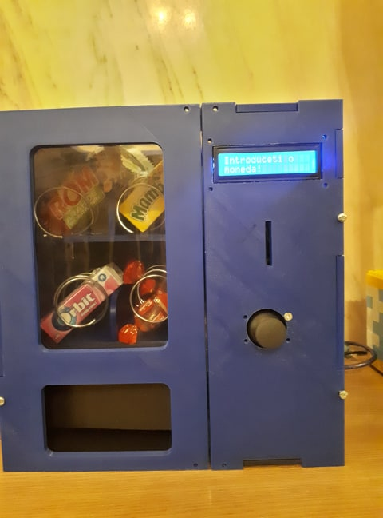

# Vending machine

## How to use instructions

The menu is very intuitive. First, you have to introduce a coin then you can scroll with the joystick through the menu to choose a product. When you have decided what you want, you press the joystick button. If you have enough coins inserted, the product will fall on the ramp that will push it out and if not, an appropiate message will apear on the screen and you have to insert more coins. Like an authentic vending machine, the things can get stuck(sorry).

## Tutorial Followed: https://www.youtube.com/watch?v=-gdm71P1k9c&t=268s

The idea is inspired from here. Instead of servo motors I used DC motors, the LCD is different and I used a joystick to walk through the menu and select the product to save some wires and to be more interactive. I added a servo motor to make a "door" or a "ramp" for the products when they fall.

## Demo video link : https://www.youtube.com/watch?v=5ubWRicCY0o

## BOM File link : https://docs.google.com/spreadsheets/d/1Htry010sDG5Vxl1XxuDkIDsEU6a6pIBbHVVmY9l-o_E/edit#gid=1301565485

## Hardware required: 
- Arduino Mega
- Motor Shield l293d
- 4 DC motors
- Joystick
- LCD display
- 4 springs
- Servo motor
- Ultrasonic Sensor
- Lots of wires

### Assembled hardware

## How it works

An ultrasonic sensor is used to detect the coins inserted. The X-asis of the joystick is used to scroll through the LCD display menu and the switch button from it is used to select the product. The DC motor is spinning the spring to make the product fall. Then, a servo motor open a "door" once a product falls and when it closses the product is pushed outside(in other words, it acts like a ramp). 

